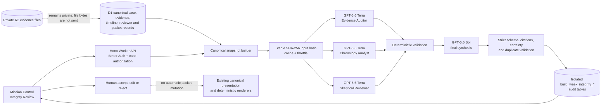

# PermitPulse

PermitPulse combines a static outreach site with a Cloudflare-hosted case workspace for evidence-backed permit intelligence and professional Permit Review Packet production.

## What’s live in this version

- **PermitPulse Stuck Project Desk (starting at $299)**: 48-hour public-record status packet for one stuck permit, utility, correction, or property-record issue.
- **Quick Address Screen ($49 pilot)**: lightweight first-pass address screen before deciding whether a full packet is needed.
- **Canonical Sample Permit Review Packet**: `dist/assets/docs/PermitPulse-Permit-Review-Packet-Sample.pdf`.
- **Mission Control**: the homepage introduces the current authenticated workspace and its end-to-end review flow.
- **Radar**: free tool entrypoint at `/radar/` (header “Free tools” should link here).
- **Help Guides**: LA permit help pages + internal links.
- **Sitemap**: `dist/sitemap.xml`

## Scope and limitations (important)

- Deliverables are based on **publicly available portal data** and **public records**.
- **Public-record lookup is conditional**: some documents may be restricted, require owner authorization, specific identifiers, appointments, or agency processing time.
- **Plan sets / blueprints require owner authorization** (not included without it).
- This is **research, organization, documentation, and next-step visibility support**, not legal, code, entitlement, architectural, engineering, insurance, filing, or agency advice.

## Repo structure

- `dist/` – production site (HTML/CSS/JS) served by hosting
  - `dist/index.html` – homepage
  - `dist/permit-due-diligence-los-angeles/index.html` – legacy Permit Review Plus page
  - `dist/assets/docs/PermitPulse-Permit-Review-Packet-Sample.pdf` – canonical fictional sample packet
  - `dist/sample-report/index.html` – compatibility redirect to the canonical packet
  - `dist/sitemap.xml` – sitemap

## Key routes

- `/` – Home
- `/permit-due-diligence-los-angeles/` – legacy Permit Review Plus page
- `/assets/docs/PermitPulse-Permit-Review-Packet-Sample.pdf` – Canonical sample packet
- `/sample-report/` – Legacy redirect to the canonical sample packet
- `/radar/` – Free tools / radar
- `/pricing/` – Pricing (if present)
- `/book` or `/booking.html` – Booking / intake (if present)

## Payments and intake

- Stripe Payment Links may be hard-coded in legacy service pages.
- Intake forms use Formspree (or equivalent) endpoints configured in the relevant page/script.
- After changing Stripe links or endpoints, verify:
  - buttons open correct link
  - mobile layout is intact
  - GA/event tracking still fires (if enabled)

## Deploy

This site is intended to be deployed as static files (Cloudflare Pages or similar).

Typical flow:
1. Edit files in `dist/`
2. Commit to `main`
3. Hosting auto-builds / publishes

## Development

If you just edit static HTML/CSS in `dist/`, you can preview locally with any static server:

```bash
python3 -m http.server --directory dist 8080
```

## OpenAI Build Week 2026 Extension

The **PermitPulse Case Integrity Engine** is an isolated Build Week extension
inside the authenticated case workspace in `app/`. It adversarially reviews a
canonical permit case before packet release. This work has **not** been
deployed to production, does not change production secrets, and is disabled in
the tracked production Worker configuration.

### Baseline and provenance

- Official comparison baseline: tag `build-week-baseline-2026`, commit
  `5e32ed6fc6792204a4e9402e0bb47f9fabc0c8a1` (July 14, 2026).
- Strict pre-July-13 snapshot: commit
  `9bba2b6b8098f8bcd8c6536f19521e7fc88f8d82` (July 12, 2026).

The official tag was created after July 13, so both anchors are recorded rather
than presenting the tag as the strict pre-event snapshot. At the July 12
snapshot, PermitPulse already had Better Auth and D1-backed sessions; structured
case records; an evidence register with provenance and verification state;
source-linked canonical timeline events; reviewer findings, questions, actions,
and an Action Kit; packet readiness rules; deterministic HTML, text, and PDF
rendering; Mission Control; and the fictional Arroyo Vista ADU case. It also had
a local deterministic/mock AI-review scaffold, but no live OpenAI call or
persistent generated review. The tagged baseline additionally contains the
private R2 Evidence Inbox and the hardened immutable packet/delivery lifecycle.
None of those baseline capabilities is claimed as Case Integrity Engine work.

### What Build Week adds

Core integrity-specific domain, prompt, validation, persistence, API, and client
code is namespaced `build-week-integrity`; existing files are touched only to
mount the routes and panel, register feature flags, and extend the fictional
demo fixture. Migration
`app/migrations/0011_build_week_case_integrity.sql` uses only
`build_week_integrity_*` tables. The extension adds:

- A server-only OpenAI Responses API pipeline. Three GPT-5.6 Terra specialists
  run in parallel as Evidence Auditor, Chronology Analyst, and Skeptical
  Reviewer; GPT-5.6 Sol then synthesizes their validated work.
- Strict JSON Schema responses plus Zod parsing and deterministic validation.
  Every material item must cite an evidence ID in the current case, separate a
  verified fact from an inference and an unknown, include category, severity,
  confidence, rationale, corrective action, and packet-readiness impact, and
  avoid approval or legal-certainty language. Duplicate recommendations are
  consolidated, and synthesis must produce exactly one next-best action.
- A stable canonical snapshot and SHA-256 input hash covering the case,
  evidence register, timeline, reviewer workspace, dependencies, packet input
  revisions, active packet generation, and presentation version. Snapshot
  assembly rechecks revisions to reject concurrent input changes.
- D1 audit records for runs, model IDs, prompt/schema versions, input snapshots
  and hashes, per-stage status and OpenAI response IDs, synthesized items and
  citations, immutable reviewer-decision events, reviewer-edited text,
  timestamps, and optional packet-generation linkage. The five isolated tables
  are `build_week_integrity_runs`, `build_week_integrity_stages`,
  `build_week_integrity_items`, `build_week_integrity_item_evidence`, and
  `build_week_integrity_decision_events`.
- Completed-run reuse only when case, hash, prompt/schema versions, and both
  model IDs match; a 60-second per-case throttle; and one non-archived running
  review per case. A cache hit is labeled as cached rather than presented as a
  new live run.
- An administrator-only Integrity Review panel in Mission Control with a run
  control, specialist/synthesis progress, summary and severity counts,
  evidence-linked result cards, confidence and rationale, packet-readiness
  impact, and version-safe Accept, Edit, and Reject decisions. Every generated
  item begins in `pending` state.
- A deterministic, fictional-only demo fixture that preserves the contrast
  between a resubmittal intake receipt, an older portal correction status, and
  the absence of reviewer-reassignment evidence. An intentionally unsupported,
  low-confidence reassignment finding is stored as an unapproved reviewer
  draft so the engine can challenge it.
- An administrator-only demo reset that reconciles the Arroyo Vista seed and
  archives completed/failed integrity runs without touching unrelated cases.

The extension adds these authenticated API routes:

| Method | Route | Purpose |
| --- | --- | --- |
| `GET` | `/api/v1/build-week/integrity/config` | Read safe feature/model availability flags. |
| `POST` | `/api/v1/build-week/integrity/demo/reset` | Reset the fictional demo when demo mode is enabled. |
| `POST` | `/api/v1/cases/:caseId/integrity-reviews` | Run or reuse an integrity review. |
| `GET` | `/api/v1/cases/:caseId/integrity-reviews/latest` | Read the latest non-archived run. |
| `GET` | `/api/v1/cases/:caseId/integrity-reviews/:runId` | Read one run, its stages, items, and audit state. |
| `PATCH` | `/api/v1/cases/:caseId/integrity-reviews/:runId/items/:itemId` | Accept, edit, or reject a draft with optimistic versioning. |

### Architecture



### How Terra, Sol, and Codex are used

The three specialist requests use the configured model identifier
`gpt-5.6-terra`. Each gets the same bounded canonical snapshot with a distinct
adversarial focus. Their calls execute concurrently, and synthesis does not
start unless all three responses pass the strict schema, case-local citation,
analyst-attribution, and prohibited-language checks. The final request uses
`gpt-5.6-sol` to verify the leads against the snapshot, consolidate overlap,
and select one best next question or action. The Responses API request uses
strict `json_schema` output, `store: false`, and is made only by the Worker;
the OpenAI API key is never returned to or read by browser code.

Codex was used as an engineering assistant to inspect the existing repository
and git history, map the canonical data and rendering boundaries, implement the
isolated vertical slice, author deterministic validation and tests, review the
Mission Control integration, and document the result. Codex did not deploy the
application, alter remote data, create production resources, or approve any AI
finding. Human reviewers retain every product and packet-release decision.

### Local setup

Requirements are Node.js 22+, the existing D1 `DB` binding, and the existing
Better Auth configuration. From the repository root:

```bash
cd app
npm ci
cp .dev.vars.example .dev.vars
# Replace the BETTER_AUTH_SECRET placeholder with a local 32+ character secret.
npm run db:migrate:local
npm run dev
```

The extension-specific environment variables are:

| Variable | Required behavior |
| --- | --- |
| `BUILD_WEEK_INTEGRITY_ENABLED` | Must be exactly `true` to expose the extension. Defaults off in production. |
| `BUILD_WEEK_DEMO_MODE` | When `true`, integrity case routes are restricted to the fictional Arroyo Vista permit and demo reset is available. |
| `BUILD_WEEK_INTEGRITY_LIVE_ENABLED` | Must be exactly `true`, with the extension enabled and a key present, before any OpenAI call can occur. |
| `OPENAI_API_KEY` | Server-side secret for live reviews. Keep it in untracked `.dev.vars` locally or an approved Worker secret in an authorized non-production environment; never put it in client code or tracked `vars`. |

`.dev.vars.example` deliberately enables the local extension and demo boundary
but keeps live reviews off. To exercise the live pipeline locally, set
`BUILD_WEEK_INTEGRITY_LIVE_ENABLED=true`, replace the API-key placeholder in
the untracked `.dev.vars`, and restart the dev server. With live mode disabled
or the key absent, the API returns a clear unavailable response and makes no AI
call; it does not fabricate a result.

### Fictional demo and reset

No shared demo credentials are committed. Use an existing local administrator
account provisioned according to `app/README.md`; local signup alone does not
grant the `admin` role. With the local server running, seed or reconcile the
case using that account:

```bash
PERMITPULSE_DEMO_ADMIN_EMAIL='your-local-admin@example.test' \
PERMITPULSE_DEMO_ADMIN_PASSWORD='your-local-admin-password' \
npm run demo:seed:local
```

Then sign in, open **Arroyo Vista ADU Resubmittal**, open **Integrity Review**
in Mission Control, and run the review. The judge-facing thread is:

1. The intake receipt verifies that the resubmittal was received.
2. The public portal evidence still displays the earlier correction stage.
3. No current-case evidence verifies reviewer reassignment.
4. The unapproved demo finding nevertheless says reassignment was confirmed.
5. The engine should challenge that overstatement and propose a narrow routing
   confirmation question; a human must then accept, edit, or reject the draft.

Use **Reset demo** in the Integrity Review panel to restore the seed and archive
its prior non-running integrity reviews. Reset is available only to an
administrator while both the extension and demo mode are enabled; it refuses
to run while a review is active and does not delete unrelated records. A
subsequent review is a real live call or a clearly labeled matching cache hit,
never simulated progress or fake AI output.

### Tests

Run the focused deterministic checks and the existing quality gates from
`app/`:

```bash
XDG_CONFIG_HOME=/tmp/permitpulse-wrangler npx vitest run \
  tests/build-week-integrity-validation.test.ts \
  tests/build-week-integrity-routes.test.ts \
  tests/demo-seed.test.ts
npm run typecheck
npm test
npm run build
```

The focused tests cover strict Terra output, missing or foreign citations,
prohibited approval/legal certainty, duplicate consolidation, and the
exactly-one next-best-action rule. Worker integration tests stub the OpenAI
transport and verify parallel specialists, Sol synthesis, pending persistence,
case-local citation failure, cache labeling, reviewer decision audit, packet
isolation, and the five-finding demo fixture while the packet remains limited
to four approved findings. The broader suite and build exercise the existing
auth, case authorization, packet, rendering, demo, and workspace boundaries.
Tests do not require a real OpenAI key and do not make a live model call.

### Limitations and human-review safeguards

- AI output is advisory draft material. It never automatically becomes a
  reviewer finding, changes a canonical case status, approves a permit, or
  enters an HTML/text/PDF packet. Accept/Edit/Reject records only the human
  integrity-review decision.
- The run captures the active packet generation and packet input revision.
  Packet linkage fields are reserved for an explicit future human-controlled
  publication workflow; the current extension intentionally performs no packet
  mutation.
- The pipeline reviews structured case and evidence metadata, not private R2
  file bytes, OCR, external portals, hidden agency systems, or law. A missing
  record remains an unknown, not evidence that an agency failed to act.
- Current Build Week bounds are 50 evidence records, 50 timeline entries, at
  most 12 observations per model response, and a synchronous Worker request.
  There is no durable background queue, automatic retry, or production cost
  dashboard in this slice.
- Administrator authorization, case scoping, trusted-origin protections,
  request-size limits, a per-case throttle, stable-input checks, strict output
  parsing, citation validation, certainty-language rejection, immutable
  decision events, and optimistic version checks are defense-in-depth. They do
  not replace professional human review.
- Production and tracked live-AI settings remain off. No production deployment,
  remote D1 migration, secret change, or real-client review is part of this
  Build Week implementation.
