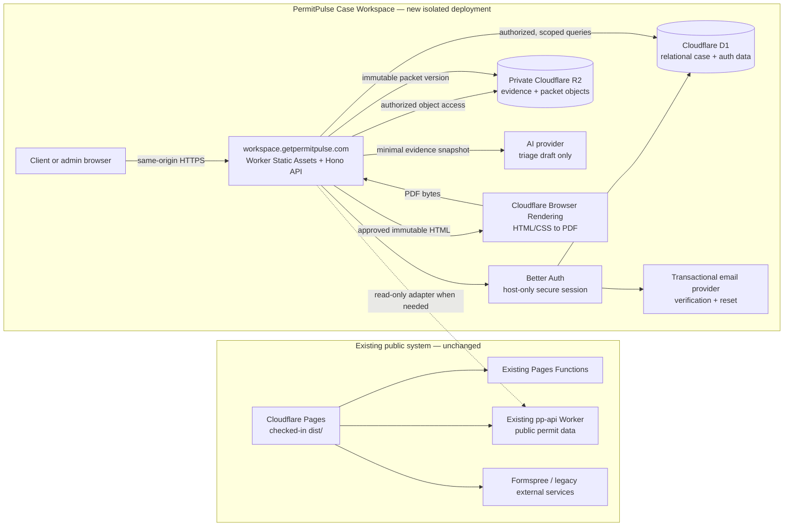

# PermitPulse Case Workspace Architecture

Status: proposed architecture; no production implementation exists yet.

Decision date: 2026-07-04

## Architecture decision

Build PermitPulse Case Workspace as an isolated full-stack project under `app/` in the existing repository. Deploy it as one Cloudflare Worker with React/Vite static assets and a Hono API on the same origin, recommended as:

```text
https://workspace.getpermitpulse.com
```

Keep all current public-site systems unchanged:

- Cloudflare Pages continues to publish the checked-in `dist/` site.
- Existing Pages Functions remain under `functions/`.
- The existing public permit API remains under `workers/pp-api/`.
- Case Workspace receives separate D1, R2, secrets, bindings, domain, CI, and deployment history.

Do not initially serve the application at `getpermitpulse.com/app`. The public Pages catch-all currently rewrites all unmatched paths to the homepage (`dist/_redirects:50-51`). A separate origin is a smaller and more reversible deployment boundary.

This is intentionally not a root monorepo conversion. `app/` should be independently installable and deployable. If a second new application later needs stable shared packages, the repository can adopt root workspaces as a separate decision.

## Recommended repository structure

```text
/
├── dist/                               # existing public site; unchanged
├── functions/                          # existing Pages Functions; unchanged
├── workers/
│   └── pp-api/                         # existing public API; unchanged
├── scripts/                            # existing marketing generators/checks
├── app/
│   ├── package.json
│   ├── package-lock.json
│   ├── tsconfig.json
│   ├── vite.config.ts
│   ├── vitest.config.ts
│   ├── playwright.config.ts
│   ├── drizzle.config.ts
│   ├── wrangler.jsonc
│   ├── worker-configuration.d.ts       # generated from bindings
│   ├── migrations/                     # reviewed forward SQL migrations
│   ├── public/                         # app-only static assets
│   ├── src/
│   │   ├── client/
│   │   │   ├── main.tsx
│   │   │   ├── routes/
│   │   │   ├── components/
│   │   │   ├── features/
│   │   │   └── lib/
│   │   ├── worker/
│   │   │   ├── index.ts               # Hono entry point
│   │   │   ├── auth/
│   │   │   ├── middleware/
│   │   │   ├── routes/
│   │   │   ├── repositories/
│   │   │   └── services/
│   │   └── shared/
│   │       ├── contracts/
│   │       ├── db/
│   │       │   ├── schema.ts
│   │       │   └── client.ts
│   │       ├── authorization/
│   │       ├── reporting/
│   │       └── validation/
│   ├── tests/
│   │   ├── unit/
│   │   ├── api/
│   │   ├── authorization/
│   │   ├── fixtures/
│   │   └── integration/
│   └── e2e/
└── .github/
    └── workflows/
        ├── case-workspace-ci.yml
        └── case-workspace-deploy.yml
```

Keep shared code inside `app/src/shared` initially. Creating repository-wide packages before a second consumer exists would add coordination without reducing current risk.

## System diagram



## Runtime and deployment topology

### One origin for UI and API

The new Worker should:

- serve Vite's hashed assets and SPA fallback
- route `/api/*` through Hono before static-asset fallback
- mount Better Auth at `/api/auth/*`
- enable the pinned Better Auth version's required Workers AsyncLocalStorage compatibility flag (`nodejs_compat` or the narrower supported equivalent)
- reject CORS by default in production because browser and API share an origin
- allow only explicit local-development origins where required

Cloudflare currently recommends Workers Static Assets for new static/full-stack projects, while Pages remains supported. This makes a new Worker appropriate without forcing migration of the existing Pages site.

### Separate environments

Use three isolated environments:

| Environment | Host | D1 | R2 | AI/email |
|---|---|---|---|---|
| local | local Vite/Worker URL | local Miniflare D1 | local Miniflare R2 | stubbed by default |
| staging | dedicated staging hostname | staging database | staging bucket | sandbox/test credentials |
| production | `workspace.getpermitpulse.com` | production database | production bucket | production credentials |

Never bind staging code to production D1 or R2. Binding names may be the same, but resource identities must differ.

## Database table proposal

D1 is SQLite-compatible. Use text IDs generated by the application, integer/ISO timestamps consistently, foreign keys, explicit indexes, and text columns for versioned JSON. Drizzle is the schema/query layer; checked-in SQL migrations remain the deployment artifact.

### Better Auth-owned tables

Generate these from the pinned Better Auth version and Drizzle adapter rather than hand-copying a stale schema:

| Table | Purpose |
|---|---|
| `user` | identity, normalized email, verification state, system role, admin plugin fields if enabled |
| `session` | opaque session records and expiry |
| `account` | password credential/account linkage managed by Better Auth |
| `verification` | email-verification and password-reset tokens |
| `rate_limit` | database-backed auth throttling for the serverless runtime |

The application may add a constrained `role` value to the Better Auth user model: `client` or `admin`. Public signup must always create `client`; only a controlled server-side/admin operation may promote a user.

### Domain tables

| Table | Important columns and constraints | Purpose |
|---|---|---|
| `cases` | `id`, human-readable unique `case_number`, `title`, normalized address fields, jurisdiction, permit number, `status`, `created_by_user_id`, optional `assigned_admin_user_id`, optimistic `version`, timestamps, soft-close timestamp | Canonical permit case. |
| `case_participants` | composite unique `(case_id, user_id)`, relationship (`client_owner`, `client_collaborator`, `admin_assignee`), timestamps | Case-level access scope. System role alone must not grant one client access to another client's case. |
| `evidence_items` | `id`, `case_id`, type, title, factual description, source URL, source date, captured date, verification status, creator, timestamps | Structured provenance record. |
| `timeline_entries` | `id`, `case_id`, optional `evidence_item_id`, occurred date/time, category, summary, detail, creator, timestamps | Human-controlled case chronology. |
| `files` | `id`, `case_id`, optional evidence link, opaque R2 key, original name, media type, byte size, SHA-256, lifecycle status, uploader, timestamps, deleted timestamp | Metadata and authorization anchor for every private object. |
| `prompt_versions` | `id`, prompt family, immutable version, template/schema text or immutable object key, SHA-256, status, creator, created timestamp | Exact prompt and output-schema provenance. |
| `ai_runs` | `id`, `case_id`, `prompt_version_id`, provider, model, model configuration JSON, input snapshot JSON/hash, provider response ID, status, output JSON, token/usage data, error code, requester, start/end timestamps | Reproducible AI execution record. |
| `triage_drafts` | `id`, `case_id`, `ai_run_id`, revision number, structured content JSON, status, author type/user, `supersedes_id`, timestamps | Draft that AI can propose but cannot approve or publish. |
| `approvals` | `id`, `case_id`, target type/id, decision, reviewer user ID, comment, created timestamp | Immutable human decision record. |
| `packet_versions` | `id`, `case_id`, monotonically increasing version, approved draft/approval IDs, report-template version, canonical input hash, HTML object key, PDF file ID, status, creator, timestamps | Immutable branded output history. |
| `audit_events` | `id`, actor user/session, case ID, action, target type/id, metadata JSON with redaction, request correlation ID, created timestamp | Append-only application audit trail. |
| `idempotency_keys` | scoped unique key, actor, operation, request hash, result reference, expiry | Prevent duplicate create/upload/AI/PDF mutations. |

### Case status proposal

Store validated text values rather than database-specific enums:

```text
draft
submitted
in_review
triage_draft_ready
awaiting_approval
approved
packet_ready
closed
```

Transitions belong in one domain service and are covered by unit tests. Direct arbitrary status updates are not an API feature.

### Index proposal

At minimum:

- unique `user.email`
- `session.token`/expiry indexes generated by Better Auth
- unique `cases.case_number`
- `cases(status, updated_at)`
- `cases(assigned_admin_user_id, status)`
- unique `case_participants(case_id, user_id)` plus reverse `(user_id, case_id)`
- `evidence_items(case_id, captured_at)`
- `timeline_entries(case_id, occurred_at)`
- unique `files.r2_key`, plus `files(case_id, created_at)`
- unique `prompt_versions(family, version)`
- `ai_runs(case_id, created_at)`
- unique `triage_drafts(case_id, revision)`
- unique `packet_versions(case_id, version)`
- `audit_events(case_id, created_at)` and `audit_events(actor_user_id, created_at)`

Every repository query must be reviewed for bounded pagination and indexed filters; D1 billing and latency are both affected by unnecessary row scans.

## API route proposal

Use `/api/v1` for application routes. Better Auth keeps its own `/api/auth/*` contract.

### Authentication

| Method and route | Access | Purpose |
|---|---|---|
| `GET/POST /api/auth/*` | public/session-dependent | Better Auth handler |
| `GET /api/v1/me` | authenticated | Current user, role, and safe session summary |

### Cases

| Method and route | Access | Purpose |
|---|---|---|
| `GET /api/v1/cases` | authenticated | Paginated cases scoped by participant or admin role |
| `POST /api/v1/cases` | authenticated | Create a case; client becomes participant |
| `GET /api/v1/cases/:caseId` | case participant/admin | Case detail |
| `PATCH /api/v1/cases/:caseId` | capability and status dependent | Validated editable fields with optimistic version |
| `POST /api/v1/cases/:caseId/transitions` | admin, except explicit client submit | Apply a valid state transition |
| `GET/POST /api/v1/cases/:caseId/participants` | admin; limited self-read | Manage case access |

### Evidence and timeline

| Method and route | Access | Purpose |
|---|---|---|
| `GET/POST /api/v1/cases/:caseId/evidence` | participant/admin; write policy by status | List/create evidence metadata |
| `GET/PATCH/DELETE /api/v1/cases/:caseId/evidence/:evidenceId` | scoped capability | Read/update/soft-delete evidence |
| `GET/POST /api/v1/cases/:caseId/timeline` | participant/admin read; admin write by default | List/create entries |
| `PATCH/DELETE /api/v1/cases/:caseId/timeline/:entryId` | admin | Edit/soft-delete entries with audit |

### Files

| Method and route | Access | Purpose |
|---|---|---|
| `POST /api/v1/cases/:caseId/files` | participant/admin | Capped multipart upload through Worker |
| `GET /api/v1/cases/:caseId/files` | participant/admin | File metadata |
| `GET /api/v1/cases/:caseId/files/:fileId/content` | participant/admin | Authorized R2 stream; attachment by default |
| `DELETE /api/v1/cases/:caseId/files/:fileId` | scoped capability | Mark deleted and schedule/perform object deletion |

For the first release, proxy uploads through the Worker. A later direct-upload design may add upload intents and short-lived presigned PUT URLs, but only with finalization, content verification, expiry, and orphan cleanup.

### AI triage and approval

| Method and route | Access | Purpose |
|---|---|---|
| `POST /api/v1/cases/:caseId/ai-runs` | admin | Start one idempotent triage run against an evidence snapshot |
| `GET /api/v1/cases/:caseId/ai-runs` | admin | Run history and status |
| `GET /api/v1/cases/:caseId/triage-drafts/:draftId` | admin; client only if explicitly published | Draft detail with citations |
| `POST /api/v1/cases/:caseId/triage-drafts/:draftId/revisions` | admin | Human edit as a new immutable revision |
| `POST /api/v1/cases/:caseId/triage-drafts/:draftId/approval` | admin | Approve or reject; records reviewer and comment |

### Packets

| Method and route | Access | Purpose |
|---|---|---|
| `POST /api/v1/cases/:caseId/packets` | admin | Generate from an approved immutable draft |
| `GET /api/v1/cases/:caseId/packets` | participant/admin | Version history with visibility rules |
| `GET /api/v1/cases/:caseId/packets/:packetId` | participant/admin | Packet metadata |
| `GET /api/v1/cases/:caseId/packets/:packetId/pdf` | participant/admin | Authorized PDF stream |

### Operational

| Method and route | Access | Purpose |
|---|---|---|
| `GET /health/live` | restricted/public minimal | Process liveness only; no external probes |
| `GET /health/ready` | deployment monitor | Binding/database readiness with no sensitive detail |
| `GET /api/v1/cases/:caseId/audit` | admin | Paginated case audit history |

Use a consistent error envelope with a correlation ID. Do not return stack traces, provider response bodies, SQL, internal object keys, or raw auth tokens.

## Authentication and authorization design

### Authentication

- Better Auth with the Drizzle SQLite adapter over D1.
- Email/password signup with required email verification.
- Password reset through a selected transactional email provider.
- Same-origin, host-only session cookies on `workspace.getpermitpulse.com`.
- Cookies forced `Secure`, `HttpOnly`, and appropriate `SameSite` settings in production.
- High-entropy Better Auth secret stored only as a Worker secret; design for secret rotation.
- `trustedOrigins` limited to the production workspace origin and explicit staging/local origins.
- Cloudflare client IP configuration uses the trusted `cf-connecting-ip` header.
- Database-backed Better Auth rate limiting; in-memory rate limiting is not sufficient for a distributed serverless runtime.
- Admin users are seeded/promoted out of band. Signup payloads cannot set role.
- Email verification, reset, and signup responses must avoid account enumeration.

### Authorization

Authorization is a server-side capability check, not a React route guard.

| Capability | Client | Admin |
|---|---:|---:|
| Create case | yes | yes |
| List/read case | assigned cases only | all cases |
| Edit intake fields | assigned case while status permits | yes |
| Add evidence/files | assigned case while status permits | yes |
| Edit canonical timeline | no by default | yes |
| Start AI triage | no | yes |
| View internal AI drafts | no | yes |
| Approve/reject draft | no | yes |
| Generate packet | no | yes |
| View published packet | assigned case | yes |
| Manage participants/roles | no | yes |
| Read audit trail | no | yes |

Every case-scoped request follows this order:

1. resolve and validate session
2. load the case through a query scoped to the actor
3. check system role, participation, requested capability, and case status
4. perform the mutation in the same service layer
5. append an audit event

Never load by object ID and authorize only after returning or mutating it. D1 has no application-aware row-level security; scoped repository queries are the primary isolation boundary.

## Environment variables and bindings

### Required bindings

| Binding | Type | Purpose |
|---|---|---|
| `DB` | D1 | Better Auth and all structured application data |
| `CASE_FILES` | R2 | Private evidence, report HTML, and PDF objects |
| `BROWSER` | Browser Rendering | HTML/CSS PDF generation |

Optional later, only after demonstrated need:

| Binding | Type | Purpose |
|---|---|---|
| `CASE_JOBS` | Queue | Durable AI/PDF job execution and retries |

### Non-secret variables

- `APP_ENV`
- `APP_ORIGIN`
- `EMAIL_FROM`
- `EMAIL_REPLY_TO`
- `OPENAI_TRIAGE_MODEL` or provider-neutral equivalent
- `MAX_UPLOAD_BYTES`
- `ALLOWED_UPLOAD_TYPES`
- `PDF_TEMPLATE_VERSION`
- `LOG_LEVEL`

Values must be environment-specific and reviewed. Model and template versions are server-owned, never request-controlled.

### Secrets

- `BETTER_AUTH_SECRET` or the pinned library's supported rotation form
- `OPENAI_API_KEY` or selected AI provider credential
- `EMAIL_API_KEY`

Declare required secret names in Worker configuration where supported so deployment fails clearly when a secret is absent. Do not use `VITE_*` for secrets; Vite variables are bundled into browser assets.

Do not reuse `PILOT_KV`, `BOOKING_KV`, or the existing public Worker's KV namespaces for Case Workspace.

## File-storage design

### Bucket policy

- one private R2 bucket per environment
- public development URL disabled
- no public custom domain
- access only through the Worker's R2 binding

### Object keys

Use opaque, non-user-controlled keys:

```text
cases/{caseId}/evidence/{fileId}/original
cases/{caseId}/packets/{packetId}/report.html
cases/{caseId}/packets/{packetId}/packet.pdf
```

Do not include email addresses, original filenames, addresses, permit numbers, or client names in keys. Keep the original filename only in D1 metadata.

### Upload sequence

1. authenticate and authorize the case
2. enforce content-length and application size limits
3. allowlist supported types and verify magic bytes where practical
4. generate `fileId` and opaque R2 key server-side
5. stream bytes to R2 while computing/recording a digest when supported by the chosen path
6. write D1 metadata with `available` status
7. on partial failure, leave a repairable `pending`/orphan state and clean it idempotently
8. append an audit event

Serve downloads through an authorized endpoint, defaulting to `Content-Disposition: attachment` and `X-Content-Type-Options: nosniff`. Never trust the uploaded media type for inline rendering.

Malware scanning is not supplied by this schema. Until a scanning service is selected, use a conservative type allowlist, quarantine status, size limits, and an explicit operator warning. Do not parse or render arbitrary uploaded HTML.

### Deletion and retention

Deletion must be explicit and auditable:

- mark metadata deleted first
- delete the object idempotently
- record completion/failure
- define retention separately for source evidence, generated packets, auth data, and audit events
- test account/case export and deletion before production

## PDF-generation design

Use HTML/CSS as the canonical report rendering format and Cloudflare Browser Rendering as the production PDF adapter.

### Deterministic pipeline

1. Require an approved `triage_draft` revision and approval record.
2. Construct a canonical packet-data snapshot containing case fields, evidence citations, timeline, approval, template version, and generated timestamp.
3. Hash the canonical snapshot.
4. Render a self-contained HTML string from a versioned TypeScript template.
5. Escape every data value; do not accept raw user or model HTML.
6. Use local/embedded fonts and branding assets with fixed versions.
7. Submit the HTML directly to the Browser Rendering PDF action. Do not ask the browser to navigate to an authenticated workspace URL.
8. Store HTML and PDF in immutable R2 keys.
9. Create `packet_versions` and `files` metadata only for that version.
10. Publish the version to the client only after generation succeeds.

Use print CSS with `@page`, fixed margins, controlled page breaks, and headers/footers. Do not overwrite prior packet objects. Regeneration creates a new packet version even when the visible changes are small.

### Failure and security handling

- fixed renderer timeout and maximum HTML size
- no caller-controlled URL navigation
- no external scripts in report HTML
- allowlisted asset origins if any network assets are unavoidable
- idempotency key for one approved-draft/template pair
- status values such as `queued`, `rendering`, `ready`, `failed`
- generic client error, detailed redacted operational log
- staging integration test because Browser Rendering's local behavior differs from the remote service

## AI run and prompt-version tracking

AI output is an evidence-backed draft, never a canonical fact or approved client deliverable.

### Prompt version

Each immutable `prompt_versions` row records:

- prompt family and semantic/internal version
- full system template or immutable object reference
- output JSON Schema version
- SHA-256
- creator and creation timestamp
- active/retired status

A production run points to a specific row; changing a prompt creates a new version.

### Input snapshot

The AI service receives a bounded snapshot, not an open database connection:

- case identifiers needed for the task
- selected structured evidence records
- selected timeline entries
- stable evidence IDs
- explicit instruction that evidence text is untrusted data, not instructions
- no file bytes unless a separate reviewed extraction step exists
- no unnecessary contact, auth, billing, or audit data

Store the exact normalized input JSON or an encrypted/private object plus its hash. Record the provider, server-selected model, relevant deterministic settings, provider response ID, usage, duration, and error category.

### Evidence-backed output

The output schema should require:

- summary claims
- risks
- missing information
- recommended actions
- `evidence_ids` for every substantive claim/action
- explicit `unsupported` or `needs_human_review` flags

After generation, validate that:

- every cited evidence ID belongs to the same case and input snapshot
- every required claim has at least one valid citation
- no unknown keys or unsafe URLs appear
- output size and list counts are bounded

Failed validation produces a failed run or a clearly flagged draft, not a publishable result.

### Human approval

- AI creates an immutable initial `triage_draft`.
- Admin edits create new revisions; they do not rewrite the AI run.
- Approval references one exact revision and records reviewer, time, and comment.
- Any post-approval content edit invalidates approval and requires a new decision.
- PDF generation accepts only an approved revision.
- Clients see only explicitly published/approved content.

## Testing strategy

### Unit tests with Vitest

- case status transitions
- role/capability matrix
- input normalization and validation
- evidence citation validator
- prompt snapshot construction and hashing
- R2 key generation
- report HTML escaping and deterministic rendering
- packet version calculation
- error-envelope and redaction helpers

### Worker/API integration tests

Use Cloudflare's Vitest Workers integration so tests execute in the Workers runtime with isolated local bindings:

- Better Auth signup, verification fixture, login, logout, expiry, reset hooks
- D1 migrations from an empty database
- Hono routes against local D1/R2
- upload/download/delete lifecycle
- idempotency behavior
- pagination and optimistic concurrency
- AI provider stub success, invalid citation, timeout, and failure
- PDF adapter stub plus a separate staging contract test

### Authorization tests

Build a table-driven suite for every case-scoped route:

- unauthenticated -> 401
- authenticated but unrelated client -> 404 or policy-consistent 403
- assigned client with disallowed action -> 403
- assigned client with allowed action -> success
- admin -> success where capability allows
- cross-case evidence/file/draft/packet IDs -> denied
- role supplied by request body -> ignored/rejected
- closed/approved case mutation -> denied according to transition rules

Authorization tests are release blockers.

### Playwright end-to-end tests

Core flows:

1. signup -> verify fixture -> login -> logout
2. client creates and edits a case
3. client adds evidence and uploads/downloads a private file
4. unrelated client cannot see the case or object
5. admin reviews the case and starts a stubbed AI run
6. admin edits and approves a draft
7. admin generates a packet
8. client sees the approved packet and version history
9. expired session returns to login without leaking cached case data

Use deterministic seeded users and cases. Do not use real customer data. Treat traces, screenshots, videos, and HTML reports as potentially sensitive; upload them only on failure and apply short retention.

### PDF tests

- unit snapshot of normalized report data and escaped HTML
- structural assertions for title, citations, approval, page CSS, and template version
- PDF smoke test in staging using the real Browser Rendering binding
- optional visual golden pages for a small fixed fixture set, reviewed intentionally
- text extraction check to ensure critical sections appear in the output

### AI tests

- no live AI calls on pull requests
- recorded/stubbed provider responses
- schema and citation validation
- prompt-injection fixtures inside evidence text
- missing/contradictory evidence fixtures
- staging-only opt-in contract test with cost cap

### GitHub Actions

PR workflow:

1. path-filter for `app/**` and its workflow
2. `npm ci` in `app/`
3. generated binding/schema drift check
4. TypeScript typecheck
5. Vite/Worker build
6. Vitest unit/API/authorization tests
7. Playwright E2E
8. upload failure artifacts with controlled retention

Deployment workflow:

1. deploy a staging version after main passes
2. run staging health/auth/file/PDF smoke tests
3. production job uses a protected GitHub environment
4. validate required secrets/bindings
5. back up/export or confirm recovery point before risky migrations
6. apply reviewed backward-compatible D1 migrations
7. deploy/version the Worker
8. run production smoke tests
9. retain deployment and migration identifiers

Use a least-privilege Cloudflare API token stored in GitHub secrets. Production deployment approval must not expose secrets to unapproved jobs.

## Security boundaries

### Boundary 1: public marketing versus private workspace

- Separate hostname, Worker, data stores, bindings, and deployment.
- No workspace session cookie is needed by or sent to the marketing origin.
- Existing wildcard-CORS Pages endpoints are not trusted workspace backends.
- Public permit data is untrusted external input even when it originates from the existing Worker.

### Boundary 2: browser versus Worker

- Browser input, route IDs, filenames, media types, and role claims are untrusted.
- Worker owns authentication, authorization, validation, state transitions, object keys, model selection, and template selection.
- React route guards improve UX only; they do not grant access.
- Mutation routes enforce same-origin/CSRF protections and rate limits.

### Boundary 3: Worker versus D1

- The Worker binding has broad database access; D1 does not enforce the application's case-membership rules.
- Repository functions must include actor/case scope in queries.
- Use parameterized Drizzle queries.
- Return only explicit response DTOs, never raw auth or database rows.

### Boundary 4: Worker versus R2

- Bucket remains private.
- D1 file metadata is the authorization index.
- Object keys are opaque.
- Downloads pass through authorization.
- Uploads are quarantined/validated and never executed.

### Boundary 5: Worker versus AI provider

- Send only task-required evidence.
- Treat evidence as untrusted quoted data.
- No provider key in browser code.
- AI cannot mutate cases, approve drafts, or generate a publishable packet directly.
- Cost, concurrency, model, and timeout are server controlled.

### Boundary 6: Worker versus PDF renderer

- Renderer receives fixed, escaped HTML, not an arbitrary URL.
- No customer-controlled scripts or raw HTML.
- Renderer output is untrusted bytes until type/size checks pass.
- Packet metadata is committed only after successful object storage.

### Boundary 7: operator/admin

- Admin is powerful but still authenticated, rate limited, and audited.
- Avoid shared admin credentials.
- Sensitive actions require recent authentication where supported.
- Role changes, participant changes, approval, packet publication, and deletion always create audit events.

### Required web controls

- strict app-specific CSP compatible with the Vite bundle
- `frame-ancestors 'none'`
- `X-Content-Type-Options: nosniff`
- restrictive `Referrer-Policy`
- `Permissions-Policy`
- HSTS at the domain/zone level
- no inline scripts unless nonce/hash managed
- no `dangerouslySetInnerHTML` for customer/model content
- generic authorization failures that do not reveal another case's existence

## Migration and rollback model

- New app starts with no production traffic and no legacy data migration.
- Every milestone deploys to staging first.
- D1 migrations use expand/contract:
  1. add compatible schema
  2. deploy code that can use old/new shape
  3. backfill if needed
  4. enforce constraints/remove old shape in a later milestone
- Configure D1's migration directory/pattern explicitly for the checked-in Drizzle SQL layout, and run only reviewed generated SQL.
- Worker rollback does not roll back D1/R2 state. Record migrations separately and write compensating migrations when necessary.
- R2 objects and packet versions are immutable; rollback changes which version is visible, not historical bytes.
- Feature flags may hide unfinished UI, but server authorization and validation must be complete before a feature is enabled.
- The existing public deployment remains untouched until a separately approved task adds a link or route.

## Highest-risk integration

The highest-risk integration is Better Auth plus case-level authorization on Workers/D1. A session bug, cross-origin cookie mistake, or missing case-membership filter can expose private case records and files across clients. It must be proven in staging and protected by exhaustive route-level authorization tests before R2 uploads, AI, or PDF features are enabled.

PDF rendering is the highest operationally uncertain integration because the managed browser differs from local tests, but its blast radius is smaller when generation is admin-only and based on approved immutable snapshots.

## Current primary documentation basis

Verified on 2026-07-04:

- [Cloudflare Workers Static Assets](https://developers.cloudflare.com/workers/static-assets/)
- [Cloudflare Workers Vite plugin](https://developers.cloudflare.com/workers/vite-plugin/)
- [Cloudflare D1 migrations](https://developers.cloudflare.com/d1/reference/migrations/)
- [Cloudflare Workers Vitest integration](https://developers.cloudflare.com/workers/testing/vitest-integration/)
- [Cloudflare R2 presigned URLs](https://developers.cloudflare.com/r2/api/s3/presigned-urls/)
- [Cloudflare Browser Rendering PDF action](https://developers.cloudflare.com/browser-run/quick-actions/pdf-endpoint/)
- [Cloudflare Workers GitHub Actions](https://developers.cloudflare.com/workers/ci-cd/external-cicd/github-actions/)
- [Drizzle with Cloudflare D1](https://orm.drizzle.team/docs/sqlite/connect-cloudflare-d1)
- [Better Auth Drizzle adapter](https://better-auth.com/docs/adapters/drizzle)
- [Better Auth Hono integration](https://better-auth.com/docs/integrations/hono)
- [Better Auth rate limiting](https://better-auth.com/docs/concepts/rate-limit)
- [Better Auth email/password security](https://better-auth.com/docs/authentication/email-password)
- [Playwright CI guidance](https://playwright.dev/docs/ci-intro)
